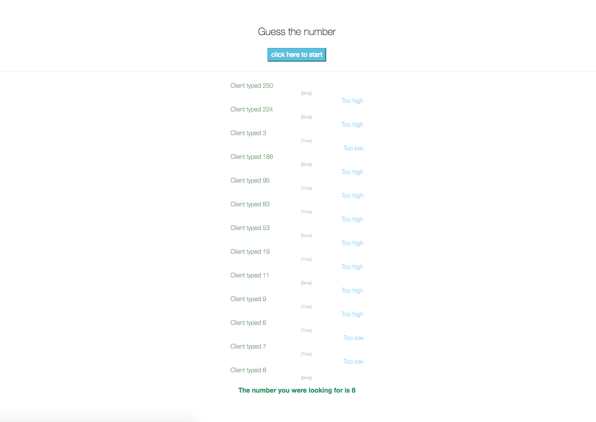

# Guess the number

Client-server web application to guess randomly generated number.
Application is generating random number from 1 to 10000 on window load, and then trying to guess this number.




## Getting Started

These instructions will get you a copy of the project up and running on your local machine.


### Installing

Assuming you’ve already installed [Node.js](https://nodejs.org/en/), create a directory to hold your application, and make that your working directory.


```
git clone https://github.com/wojtek474/Guess-the-number.git
cd Guess-the-number
cd server
npm install -g forever nodemon
npm install
```

To start server, use the following command
```
npm start
```


And now all you have to do is double-click on index.html in the main folder of application.


## Built With

* [express](https://expressjs.com/) - minimal and flexible Node.js web application framework
